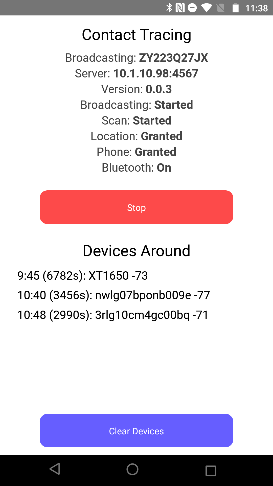

# Bluetooth LE Contact Tracing Tracker Uploader. 



Ultra simple app to track BLE devices on Android using the Phone's Serial Number as UUID (not private). 

Together with the server, this app allows companies to track their phones when they are near each other. 

## Behavior

1. Get consent to locally track bluetooth using the Phone's Serial Number (non private)
2. Locally cache a minute-by-minute database of: ``` Contact |  Date/Time  |  RSSI ```
3. Wake the app at every 15 minutes to scan and broadcast BLE
4. Upload all data to a server (not private). See: https://github.com/vitorpamplona/ble-tracker-server

# Development Overview

This is a React Native app version 61.5

## Requirements

* Git
* NVM
* Node (10.1 or newer)
* Yarn
* Watchman
* OpenJDK (for Android building and installing)
* Android Studio (SDK, AVD)
* CocoaPods (Required for installing iOS dependencies)
* XCode (for iOS Dev)
* ios-deploy (installing your app on a physical device with the CLI)

## Running

Install modules:
```yarn install``` 

To run, do:
```
npx react-native run-android
```
or
```
npx react-native run-ios --simulator="iPhone 8 Plus"
```

NOTE: In some cases, the abovementioned procedure leads to the error `Failed to load bundle - Could not connect to development server`. In these cases, kill all other react-native processes and try it again.
